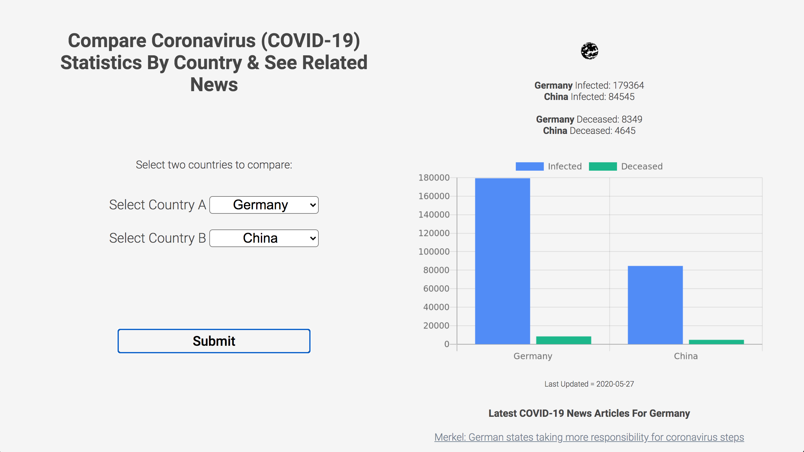

App name:
"COVID Compare"

Link to live app: 

Screenshot:

Summary of app:
COVID Compare allows users to retrieve coronavirus (COVID-19) statistics for two countries of their choice and see these statistics represented graphically, side by side, making them easy to compare. The latest news articles related to COVID-19 for both countries is also displayed in the browser. 

Technologies used:
HTML, CSS, JavaScript, jQuery.

